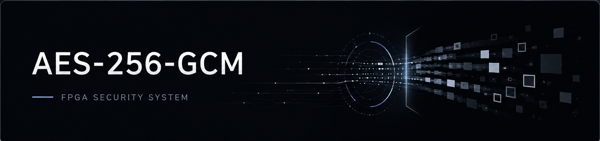
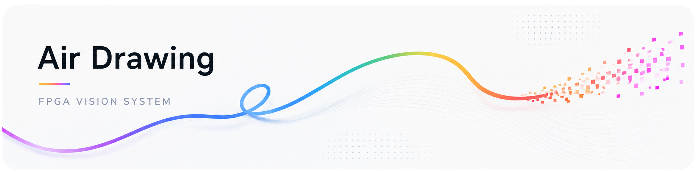

# 하지훈 | Ji Hoon Ha

**FPGA · RTL Design · Design Verification**

SystemVerilog RTL 설계 · UVM 기반 검증 · FPGA/SoC 시스템 통합

## Core Competencies

- SystemVerilog 기반 합성 가능한 RTL 설계 및 FPGA 구현
- UVM 검증 환경 구축과 Synopsys VCS/Verdi 기반 기능 검증
- ARM Cortex-M 기반 STM32 임베디드 소프트웨어 개발

## Technical Skills

**HDL / Programming**

  
  
  
  
  

**Design / Implementation**

  
  
  
  

**Verification**

  
  
  

## Featured Projects

Rolling-Shutter OCC 자격증명 전달부터 FPGA 영상 기밀성 보호, Jetson 기반 MITM(Man-in-the-Middle) 공격, 수신단 무결성 검증 및 차단까지 통합한 팀 프로젝트입니다.

- Zybo Z7-20, NVIDIA Jetson Orin Nano, Pcam 5C, Basys 3 및 OV7670 활용
- Zybo Z7-20 PL의 DDR 기록 전 AES-256-GCM 암호화 및 RX 인증 전 평문 외부 방출 차단
- Jetson 기반 MITM 패킷 변조·Replay 공격 및 관찰 환경 통합
- [AES-256-GCM Core](https://github.com/Bourrasque-21/aes256-gcm-occ/tree/main/AES256_GCM_Core)의 TX/RX RTL 설계
- AES와 GHASH의 블록 수준 병렬 처리 및 NIST AES-256 KAT 405개 통과
- OpenSSL golden 기준 C/RTL 각 10,000개 벡터 일치 및 순수 C 대비 최대 2.34배 AES-256 하드웨어 가속 검증
- [Rolling-Shutter OCC 송수신기](https://github.com/Bourrasque-21/aes256-gcm-occ/tree/main/Rolling_Shutter_OCC)의 OOK·Manchester 광통신 및 자격증명·CRC 검증

OV7670 카메라로 녹색 마커를 추적하고, 허공에 그린 궤적을 FPGA에서 실시간 합성하는 시스템을 구현한 팀 프로젝트입니다.

- Basys 3·OV7670 기반 FPGA 영상처리와 VGA·UART·Python UI 통합
- 녹색 마커 검출과 좌표 평활화, Bresenham 선 보간 및 브러시 렌더링
- 64라인 링버퍼로 BRAM 사용률을 96%에서 72%로 줄이고 640×480 영상 재구성

### [RISC-V RV32I MCU](https://github.com/Bourrasque-21/RV32I_mcu)

RV32I Multi-cycle CPU와 APB Master를 설계하고, GPIO·UART·FND Peripheral을 MMIO 방식으로 구성한 MCU/SoC 프로젝트입니다.

- RV32I Multi-cycle CPU 및 APB Master 설계
- IF · ID · EX · MEM · WB 단계 기반 제어
- 4 KB 데이터 RAM과 메모리 맵 설계
- MMIO 방식의 GPIO, UART, FND Peripheral 구성
- Basys 3 보드에서 동작하도록 설계한 SystemVerilog SoC

### [Driver Monitoring System](https://github.com/Bourrasque-21/Monitor-drowsy-driving)

운전자의 눈 위치와 눈 상태를 분석하기 위한 비전 모델을 설계하고, 하이퍼파라미터 최적화를 통해 최종 모델을 선정한 프로젝트입니다.

- YOLOv8n 기반 눈 위치 탐지 모델 설계
- MobileNetV3 및 YOLOv8n-cls 기반 눈 상태 분류 후보 모델 설계
- TPE 베이지안 최적화 알고리즘을 활용한 하이퍼파라미터 탐색 및 최적 비전 모델 선정

## Project Index

| Project | Description |
| --- | --- |
| [FPGA AES-256-GCM Security System](https://github.com/Rheinluft/AES256-GCM-Security-System) | OCC 자격증명, FPGA 영상 기밀성 보호, Jetson MITM 공격 및 RX 무결성 검증·차단을 통합한 팀 프로젝트 |
| [VGA Air Drawing](https://github.com/Bourrasque-21/VGA_AIR_DRAWING) | 녹색 마커 추적, Bresenham 선 보간 및 라인 링버퍼 기반 FPGA 실시간 에어 드로잉 팀 프로젝트 |
| [AES-256-GCM Core](https://github.com/Bourrasque-21/aes256-gcm-occ/tree/main/AES256_GCM_Core) | AES-256-GCM TX/RX RTL 설계 및 NIST KAT 검증 |
| [Rolling-Shutter OCC](https://github.com/Bourrasque-21/aes256-gcm-occ/tree/main/Rolling_Shutter_OCC) | Basys3·OV7670 기반 OOK/Manchester 광통신 송수신 설계 |
| [RISC-V RV32I MCU](https://github.com/Bourrasque-21/RV32I_mcu) | RV32I Multi-cycle CPU와 APB Master 설계, MMIO 방식 Peripheral 구성 |
| [Driver Monitoring System](https://github.com/Bourrasque-21/Monitor-drowsy-driving) | YOLOv8n 눈 위치 탐지 및 TPE 기반 눈 상태 분류 모델 최적화 |
| [Piano to Score](https://github.com/Bourrasque-21/piano_to_score) | 피아노 오디오의 note event·박자 추출, 리듬 양자화 및 MusicXML/PDF 렌더링을 연결한 Python/ML 자동 악보화 파이프라인 |
| [AES128 SoC System](https://github.com/Bourrasque-21/AES128-soc-system) | AES-128 SoC 설계 |
| [RV32I Single-Cycle](https://github.com/Bourrasque-21/RV32I_mcu/tree/main/single_cycle) | 싱글사이클 RV32I CPU RTL 설계 |
| [I2C](https://github.com/Bourrasque-21/I2C) | I2C Master/Slave RTL 및 AXI4-Lite Register Interface 설계, MicroBlaze SoC·보드 간 통신 통합과 VCS/Verdi 기반 UVM 검증 |
| [SPI](https://github.com/Bourrasque-21/SPI) | SPI Master/Slave RTL 및 AXI4-Lite Register Interface 설계, MicroBlaze SoC·보드 간 통신 통합과 VCS/Verdi 기반 UVM 검증 |
| [UART](https://github.com/Bourrasque-21/UART) | UART 8N1 RX/TX와 FIFO 기반 비동기 직렬 통신 RTL 설계 및 VCS/Verdi 기반 UVM frame 검증 |
| [RAM](https://github.com/Bourrasque-21/RAM) | Read-First/No-Change Single-Port Synchronous RAM RTL 설계 및 VCS/Verdi 기반 UVM read/write 검증 |
| [FPGA Multi-Peripheral Control System](https://github.com/Bourrasque-21/DIGITAL_SYS) | Stopwatch/Clock, SR04, DHT11, 7-Segment를 통합한 멀티모드 센서 시스템 및 UART ASCII 명령 기반 PC 제어·Watchdog Timer 구현 |
| High-Efficiency Class-A Audio Amplifier | 신호 선형성을 유지하며 전력 효율을 개선하고 Coupling capacitor 총용량 최소화 |
| Wheelchair Posture Control Device (Capstone) | 좌석 균형 유지 장치의 회로 설계, 센서 데이터 처리 및 제어 알고리즘 구현 |

  <a href="https://github.com/Bourrasque-21?tab=repositories">View all repositories →</a>

